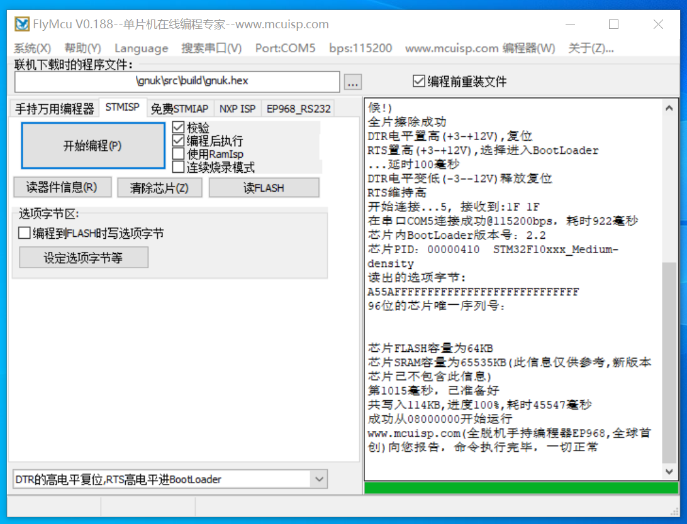
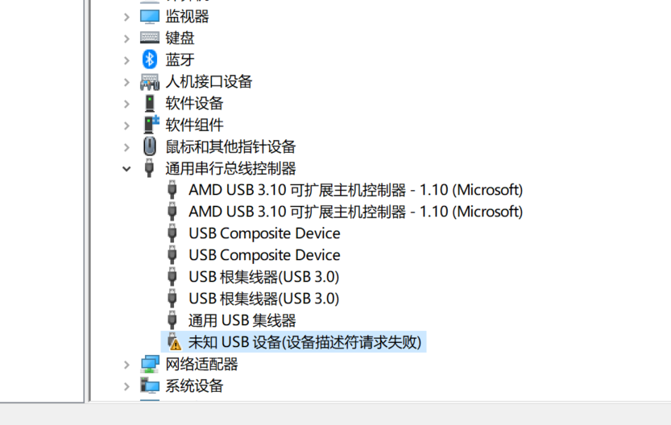
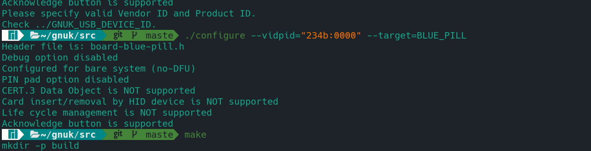
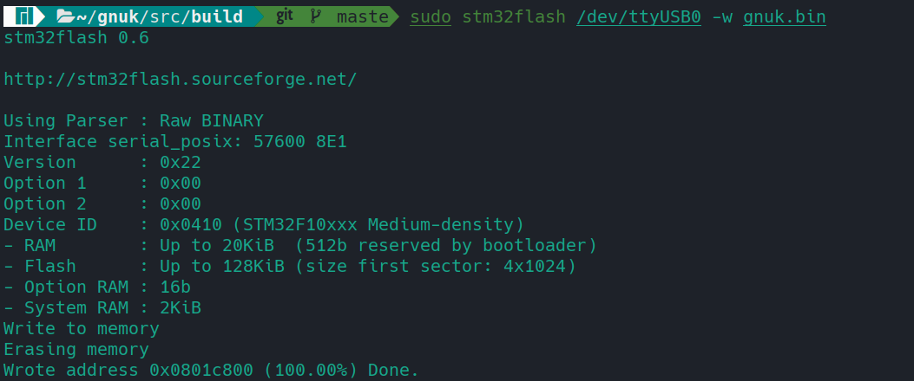
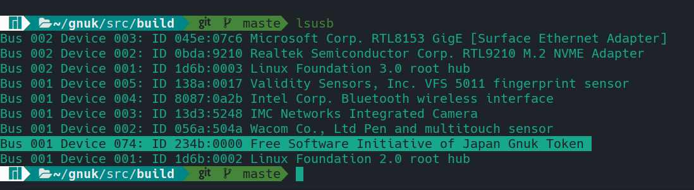
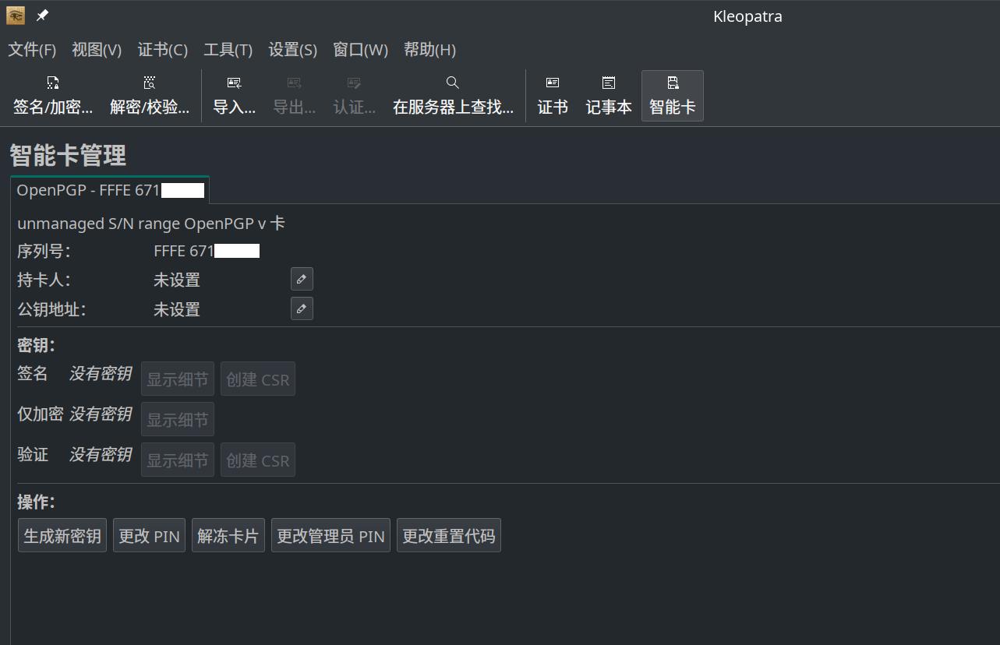

# DIY GNUK

2022/3/25

### Intro

最近迷上了硬件安全密钥。找着找着就发现了 Gniibe 大佬写的 GnuK 项目。STM32F103板子也不贵（不过比起之前可不是贵了一点半点），就买了一张刷着玩。（逃

主力电脑系统是Manjaro。GnuK帮助的编译页面中采用的是 Debain / Ubuntu 环境下编译，不过Arch/Manjaro下安装好对应软件包也就可以了。


### Manjaro Section

```bash
#安装交叉编译依赖
sudo pacman -S --needed arm-none-eabi-gcc arm-none-eabi-binutils arm-none-eabi-gdb arm-none-eabi-newlib
#克隆项目、更新子模块
git clone https://salsa.debian.org/gnuk-team/gnuk/gnuk.git
git submodule update --init
#进入编译目录
cd src/
#配置编译参数与编译
./configure --vidpid=234b:0000
make
```

接下来就可以在./build/目录中找到**gnuk-no-vidpid.elf** **gnuk.bin** **gnuk.elf** 三个文件。

这里我们需要 **gnuk.bin** 来刷入。

由于我没有st-link，所以需要用ttl刷入。这里我用的是Windows下的一个工具：FlyMCU。



刷入以后遇到了设备描述符请求失败的情况（明明configure的时候设置了vidpid）。



所以我重新configure了一下：

```bash
./configure --vidpid=234b:0000 --board BLUE_PILL
```

发现还是不行。


### “Common mistake”

在看到这篇blog的时候发现了一个工具叫[stm32flash](https://raymii.org/s/tutorials/FST-01_firmware_upgrade_via_usb.html)，也可以通过ttl刷入固件。想着可能是编程软件的问题就试了一试这个：

```shell
sudo stm32flash /dev/ttyUSB0 -w ./build/gnuk.bin
```

没啥效果。

最后发现是终端在编译的时候没有识别到冒号。加双引号后重新编译：

```shell
./configure --vidpid="234b:0000" --target=BLUE_HILL
make
```



重新刷入：

```shell
sudo stm32flash /dev/ttyUSB0 -w ./build/gnuk.bin
```




刷入完成以后重新插拔，识别了。




打开Kleopatra，就可以看到GnuK的管理界面了。当然，还可以用gnupg编辑。详细的使用在Gnuk文档或GnuPG Wiki中可以找到。




最后还是入了Yubikey。


参考资料：

1. [stm32flash的使用](https://raymii.org/s/tutorials/Nitrokey_gnuk_firmware_update_via_DFU.html#toc_1)

2. [Arch的交叉编译依赖](https://github.com/kiibohd/controller/issues/30)

3. [GnuK文档](http://www.fsij.org/doc-gnuk/development.html#hardware)

